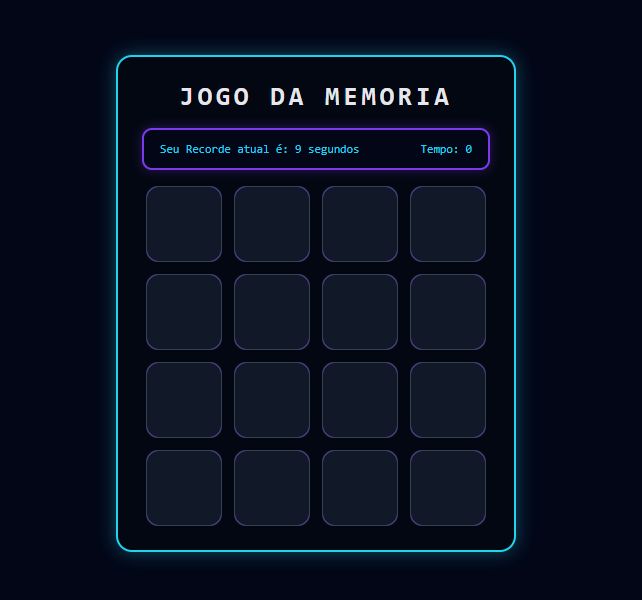
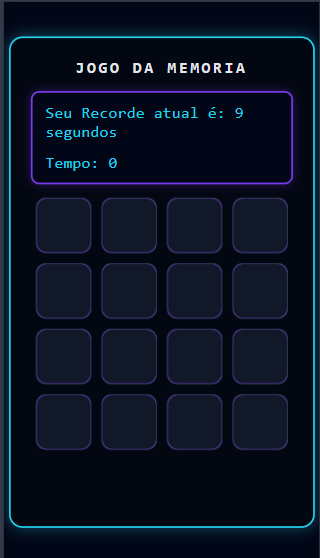

# 🧠 Jogo da Memória

Projeto de **Jogo da Memória** desenvolvido com **HTML, CSS e JavaScript puro**, com foco em lógica de programação, manipulação do DOM, responsividade e boas práticas de código.

O jogo consiste em encontrar todos os pares de cartas no menor tempo possível, com controle de tempo e sistema de recorde persistente.

---

## 🎮 Funcionalidades

* ⏱️ **Timer automático** iniciado no primeiro clique
* 🏆 **Sistema de recorde** utilizando `localStorage`
* 📊 **Painel informativo** exibindo tempo atual e melhor recorde
* 🔄 **Botão de reinício** exibido apenas ao final da partida
* 🚫 **Bloqueio de cliques rápidos**, impedindo abrir mais de duas cartas
* 🎉 **Mensagem personalizada** ao concluir o jogo
* 📱 **Layout responsivo** (desktop, tablet e mobile)

---

## 🛠️ Tecnologias Utilizadas

* **HTML5** – estrutura do jogo
* **CSS3** – estilização, animações e responsividade
* **JavaScript (Vanilla JS)** – lógica do jogo, eventos e armazenamento local

---

## 🧩 Lógica do Jogo

* Os emojis são embaralhados aleatoriamente a cada início de jogo
* O jogador pode abrir apenas **duas cartas por vez**
* Caso as cartas sejam iguais, permanecem abertas
* Caso sejam diferentes, são fechadas automaticamente
* O jogo termina quando todos os pares são encontrados

---

## 💾 Recorde

O melhor tempo do jogador é salvo no navegador utilizando **localStorage**, garantindo que o recorde permaneça mesmo após recarregar a página.

---

## 📱 Responsividade

O layout foi totalmente refatorado para se adaptar a diferentes tamanhos de tela, garantindo boa experiência tanto em **desktop** quanto em **dispositivos móveis**.

---

## 🚀 Como Executar o Projeto

1. Clone o repositório:

```bash
git clone https://github.com/seu-usuario/seu-repositorio.git
```

2. Clique no link:

https://joaoalves-devv.github.io/Jogo-de-memoria-com-emojis/

---

## 📑 Pré-visualização do projeto

1. Desktop:



2. Mobile:



## 📌 Próximas Melhorias (Ideias)

* Contador de movimentos
* Seleção de dificuldade (quantidade de cartas)
* Efeitos sonoros

---

## 👨‍💻 Autor

Desenvolvido por **joaoalves-devv** 🚀

Projeto com fins de estudo e portfólio.
